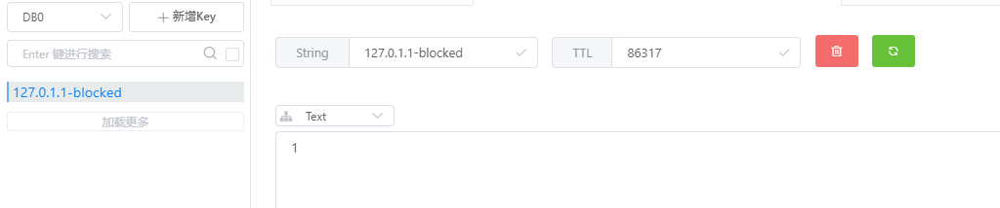
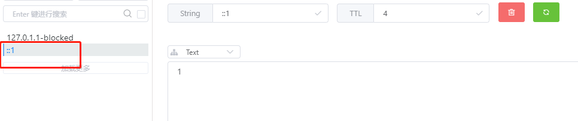
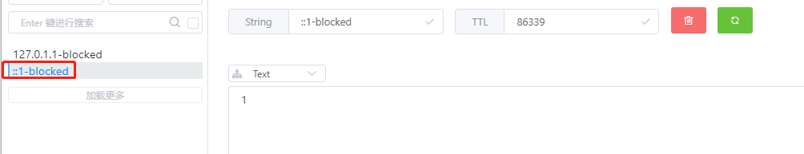

## 基于Redis的限流策略

一个基于Node + Redis的简单IP限流策略demo；

常量定义：

-   EXPIRE_SECOND：Redis中IP对应key超时时间(单个窗口时间)；
-   LIMIT_RATE：单个窗口时间(EXPIRE_SECOND)内访问限制次数；
-   BLOCK_SECOND：禁止访问后单个IP限制访问时长；
-   BLOCK_SUFFIX：禁止IP黑名单Key后缀；

### 实验前准备

#### **① 配置Redis连接**

修改index.js中Redis连接配置：

```javascript
const client = new Redis({
    port: process.env.REDIS_PORT || 6379,
    host: process.env.REDIS_HOST || 'localhost',
    password: "admin",
    family: 4, // 4 (IPv4) or 6 (IPv6)
    db: 0,
})
```

#### **② 安装依赖**

使用npm安装依赖：

```bash
npm i
```

### 实验操作

正确配置并安装依赖后，使用下面的命令启动项目：

```bash
npm start
```

此时项目默认在`localhost:3000`启动；

同时控制台输出：

```
Example app listening at http://localhost:3000
Redis connected!
127.0.1.1 has bend blocked: OK
true
false
```

这是因为执行了下面的测试函数：

```javascript
(async () => {
    let testIP = '127.0.1.1'
    let testIP2 = '127.0.1.2'
    await doBlock(testIP)
    console.log(await isBlocked(testIP))
    console.log(await isBlocked(testIP2))
})()
```

此时，IP为`127.0.1.1`由于执行了doBlock函数而被加入黑名单；

所以在下面的测试中一个输出为`true`，而`127.0.1.2`未被加入黑名单，所以输出为`false`；

同时在Redis中，可以看到这个被block的Key：



下面访问：http://localhost:3000/

显示如下：


在控制台输出：

```
::1 has value: 1
```

说明在Redis中创建了对应窗口的Key：



下面快速刷新，直到达到了窗口限频；

此时窗口显示为：


控制台显示：

```
::1 has value: 1
::1 has value: 2
::1 has value: 3
::1 has value: 4
::1 has value: 5
::1 has value: 6
::1 has value: 7
::1 has value: 8
::1 has value: 9
::1 has value: 10
::1 has value: 11
::1 has value: 12
::1 has value: 13
::1 has value: 14
::1 has value: 15
::1 has value: 16
::1 has value: 17
::1 has value: 18
::1 has value: 19
::1 has value: 20
::1 has value: 21
::1 has bend blocked: OK
```

此时Redis中可以看到`::1`已经被加入黑名单：



此后再访问页面都将会显示`Too many requests - try again later`；

最后，将Key`::1-blocked`删除；

访问恢复正常；

### 其他

更多说明见：

-   国外访问Github Pages：[Node-Redis实现基于IP的限流策略](https://jasonkayzk.github.io/2020/12/17/Node-Redis实现基于IP的限流策略/)
-   国内访问Gitee镜像：[Node-Redis实现基于IP的限流策略](https://jasonkay.gitee.io/2020/12/17/Node-Redis实现基于IP的限流策略/)

